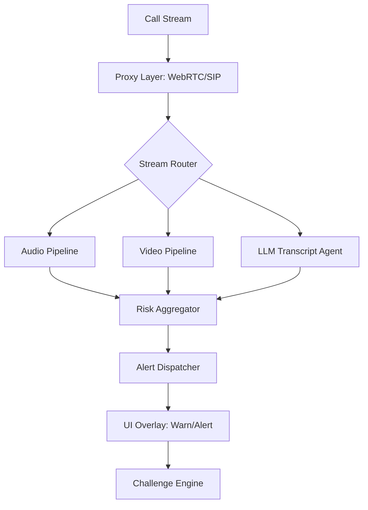

# 🛡️ DeepFake Shield Agent
**Real-time Multimodal Deepfake Detection & Fraud Prevention System**


DeepFake Shield is a privacy-first, real-time interception layer designed to protect users from AI-generated voice cloning and face-swap impersonations during live calls. By fusing spectral audio analysis, facial geometry probing, and linguistic scam scoring, Shield provides an immediate warning system before fraud can occur.

---

## 🌟 Key Features

### 🎙️ Audio Anti-Spoofing
- **Hybrid Detection**: Combines **Wav2Vec2-XLSR** (semantic artifacts) and **AASIST3** (spectral anomalies).
- **Real-time Processing**: 2-second sliding window with 512ms overlap for seamless analysis.
- **SOTA Accuracy**: Optimized for ASVspoof 2024 benchmarks.

### 👁️ Visual Forgery Detection
- **CNN-ViT Hybrid**: Detects both local blending artifacts and global facial geometry inconsistencies.
- **Active Probing**: Implements **Corneal Reflection** and **Gaze-Drift Analysis** to detect physically impossible synthetic faces.
- **Lip-Sync Monitoring**: Real-time correlation between audio energy and lip aperture.

### 🧠 Cognitive Scam Scoring
- **Local LLM Inference**: Uses **Qwen2.5-7B** via Ollama for on-device, private transcript analysis.
- **3-Step Pipeline**: Discrimination $\rightarrow$ Reflection $\rightarrow$ Summary approach to identify high-pressure fraud scripts.
- **Challenge Engine**: Generates context-aware security questions to verify identity.

### 🔄 Self-Learning Knowledge Engine
- **Autonomous Research**: Automatically crawls arXiv and Semantic Scholar for latest deepfake techniques.
- **Semantic Memory**: FAISS-backed RAG system to update detection rules based on new research.

---

## 📐 Architecture



---

## 🛠️ Tech Stack

| Layer | Technology |
| :--- | :--- |
| **ML Frameworks** | PyTorch, ONNX Runtime, HuggingFace |
| **Audio** | Librosa, Faster-Whisper, Wav2Vec2, AASIST3 |
| **Video** | MediaPipe, CNN-ViT, OpenCV |
| **LLM** | Ollama, Qwen2.5, FAISS |
| **Backend** | Python 3.11, FastAPI, Asyncio |
| **Deployment** | Docker, Android VpnService, iOS Network Extension |

---

## 🚀 Quick Start

### Prerequisites
- Python 3.11+
- [Ollama](https://ollama.ai/) installed and running.

### Installation
```bash
# Clone the repository
git clone https://github.com/dungnotnull/deepfake-shield-agent.git
cd deepfake-shield-agent

# Install dependencies
pip install -r requirements.txt

# Setup Ollama
ollama pull qwen2.5:7b

# Download Models
bash scripts/download_models.sh
```

### Running the Agent
```bash
python src/alert_engine/stream_router.py
```

---

## 🛡️ Privacy Commitment
**Zero Data Egress.** 
All processing—from audio spectrograms to LLM transcript analysis—happens locally on the user's device. No audio or video data ever leaves the local environment.

## 📜 License
MIT License. See [LICENSE](LICENSE) for details.
